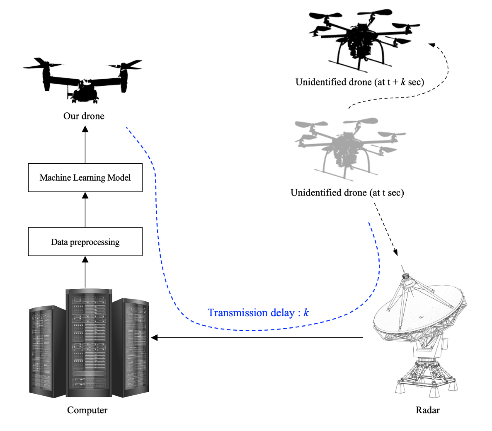

# Prediction based Auto-Pilot Interface for Drone to Object Chasing using Historical TSPI Data

## 🍻 TEAM : Beer per Day

<br>

## 👨‍💻 MEMBERS

| Name                  | Univ.                | Dept.                               |
| --------------------- | -------------------- | ----------------------------------- |
| 🤴 Shinhyoung Jang    | Chungnam Natl. Univ. | Computer Science & Engineering      |
| 😃 Byeonghwi Park     | Chungnam Natl. Univ. | Computer Science & Engineering      |
| 😃 Juheon Jeong       | Chungnam Natl. Univ. | Computer Science & Engineering      |
| 😃 Jack Mahedy        | Purdue Univ.         | Computer and Information Technology |
| 😃 Nebey Gebreslassie | Purdue Univ.         | Computer and Information Technology |

<br>

## Research problem statement

### 🛸 Motivation : How to classify the object drone or not?

1. Using digital zoom in the picture
2. Using lens with good performance

- But these have the problems that lossing data or high cost

<br>

### 🍀 So, what is the best "Approach" for the prediction?

- Suggest making drone to chase the object
- It also provides to use combat drone like self-destructive

<br>

### 🔧 Requirement

1. To improve chasing, use the prediction algorithm or machine learning model because of the latency of processes
2. Make a interface to chase specified position

<br>

## 📚 Research novelty

Making interface for drone chasing using historical TSPI Data



<br>

## 📁 Directory

```
└── Beer_per_Day/
    ├── code/
    │   └── feature/
    │       └── overview.png
    |   └── Interface/
    |       └── GoogleMap/
    |       └── ReadMe.md
    │   └── predictTrajectory/
    |       └── UAVDataset/
    |       └── DroneTrajectory.ipynb
    |   └── testPos_code/
    |       └── test_location/
    |       └── Readme.md
    ├── paper/
    │   └── paper.pdf
    ├── presentation/
    │   └── KSW 2023 Winter mid_presentation Beer_per_Day.pptx
    ├── weeklyreport/
    │   ├── K-SW 2023 Winter 01120203 Beer_per_Day.pdf
    │   ├── K-SW 2023 Winter 01200203 Beer_per_Day.pdf
    │   ├── K-SW 2023 Winter 01270203 Beer_per_Day.pdf
    │   ├── K-SW 2023 Winter 02030203 Beer_per_Day.pdf
    │   ├── K-SW 2023 Winter 02100203 Beer_per_Day.pdf
    │   └── K-SW 2023 Winter 02170203 Beer_per_Day.pdf
    └── Readme.md
```

## 🗒 Code

- Interface: Android Application Interface
- predictTrajectory: Machine Learning models to predict coordinates
- testPos_code: save the array which has list of coordinates

<br>

## 🌍 Environment settings

To know the Environment settings, please refer the table

| Code              | Directory                                                    |
| ----------------- | ------------------------------------------------------------ |
| Interface         | 📂 Beer_per_Day/code/Interface/ReadMe.md                     |
| predictTrajectory | 📂 Beer_per_Day/code/predictTrajectory/DroneTrajectory.ipynb |
| testPos_code      | 📂 Beer_per_Day/code/testPos_code/ReadMe.md                  |
